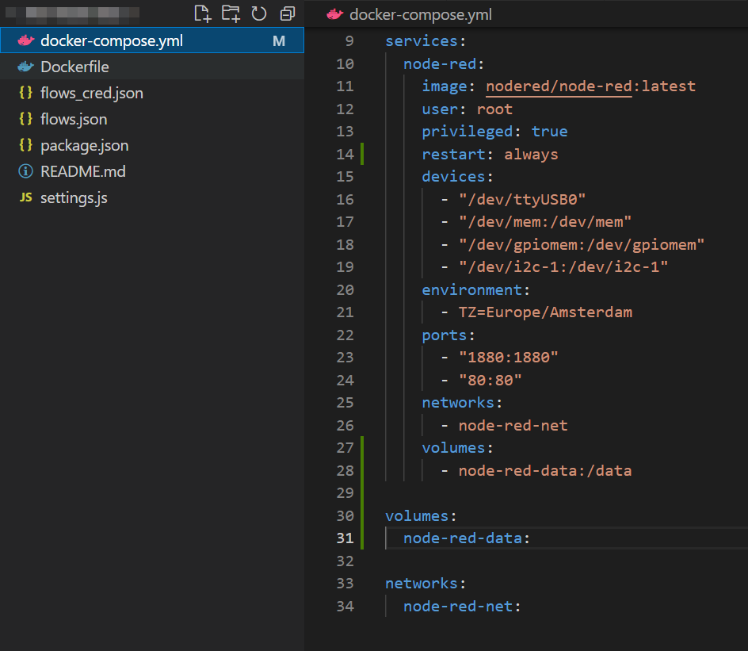

<br>
<br>
<a name="readme-top"></a>

# **Basics of Docker 🐋**

---

<br>

## Building your own images

---

Docker is a PaaS product that uses OS-virtualization to deliver software in form of packages called images. These images are composed of multiple layers, that are images by themselves. Each layer is built on top of another layer to form a series of intermediate images. This layer system allows:

- Work with Docker images faster avoiding unnecessary steps like pulling or pushing images faster skipping large unchanged data transfers.
- The use of the copy-on-write file system saves disk space for future containers and images.
- Enables you to apply less computational effort (in image building) and save on bandwidth (in image distribution) when rebuilding images by keeping the layers with the least or no changes at the bottom of the hierarchy formed.

You can easily build your own image (see [Challenge 2](../Challenge%202#build-image) for further details) by executing a build command on a Dockerfile.

```docker
docker build <URL> | <PATH> | <DockerFile>
```

(...)
continuar amb seguent link

([See more infromation](https://sweetcode.io/understanding-docker-image-layers/))

<br>

## Working with single Docker images

---

Once the image has been created, we can run it by simply executing the command:

```docker
docker run <IMAGE_NAME> (<options>)
```

In order to delete a running container, we must first stop it with the command:

```docker
docker stop <IMAGE_NAME>
```

Then, we can proceed to delete it:

```docker
docker delete <IMAGE_NAME>
```

Similar commands apply for running Docker Compose (substitute docker by docker-compose).

<br>

With regard to information about images or running containers, we can display them respectively by executing the following commands:

```docker
docker images <options>
```

```docker
docker ps <options>
```

<br>

## Ease development with Docker Compose

---

Besides images, we can pack them in multi-container applications. Each of these running images can sometimes be considered a microservice, and the more microservices you build into your environment, the more valuable it is to have each of these services in their containers. Nonetheless, you should be able to jump from one container to another, and it is precisely thanks to Docker Compose that we can connect different containers as a single service. Docker Compose is used for running multiple containers as a single service. Each of the containers here run in isolation but can interact with each other when required. ([See more information](https://www.simplilearn.com/tutorials/docker-tutorial/docker-compose))

Docker Compose files are very easy to write in a scripting language called YAML, a human-readable data-serialization language that uses both Python-style indentation to indicate nesting, and a more compact format, like [...] for lists and {...} for maps.

A YAML file (extension .yaml or .yml, indistinctly) looks like this:

<p align = "center">
  
  <p align = "center">
    <i>YAML File Example</i>
  </p>  
</p>

Another great thing about Docker Compose is that users can spin up all the services (containers) using a single [command](https://docs.docker.com/engine/reference/commandline/compose_up/):

```docker
docker-compose up -d
```

If executed once more, this command will add, update or delete any infrastructure that has changed in the docker compose declarative file. In other words, there is no need to stop, delete and recreate the services as these can be added on the fly.

Analogously, and thanks to the layer-based architecture of Docker, if a different version of a service is required, not all the image will be downloaded as many of the layers of the older version can be reused for the newer one.

<br>

## 📗 Bibliography

---

- Mouat, A. _Using Docker: Developing and Deploying Software with Containers_. (1st ed.). O'Reilly, 2015

<br>

## 🎓 License

---

This repository and thereby all its content is licensed under the MIT License - see the [LICENSE.md](LICENSE.md) file for details

<br>

## Further Issues and questions ❓

---

If you have issues or questions, don't hesitate to contact Marc Herranz i Alié at [mherranz98@gmail.com](mailto:mherranz98@gmail.com).
