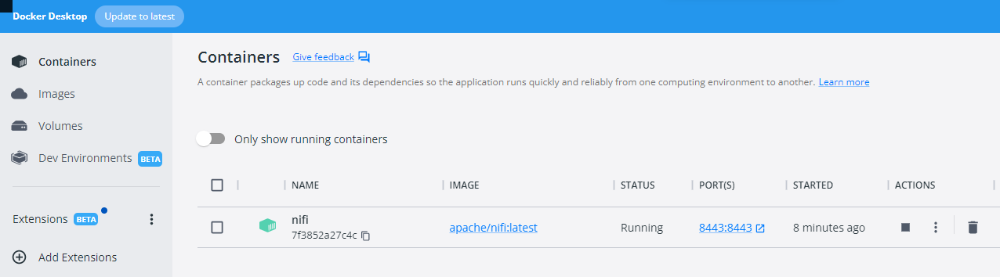

<br>
<br>

# **Challenge 1: Apache Nifi with local file and API 🐋🧑🏼‍💻**

---

<br>

## **First step**: Download the Apache Nifi from Docker Hub with a "docker pull" command

In the host CLI we execute the following command:

```bash
docker pull apache/nifi
```

Because a version is not specified in the command, the lastest will be downloaded in our local image repository. Once downloaded, we can execute the command:

```bash
docker images
```

and a detailed list of the available downloaded images will be displayed.


<br>

## **Second step**: Instantiate the apache/nifi image

Once downloaded the image, we need to make it run by executing the following command:

```bash
docker run --name nifi \
  -p 8443:8443 \
  -d \
  -e SINGLE_USER_CREDENTIALS_USERNAME=admin \
  -e SINGLE_USER_CREDENTIALS_PASSWORD=ctsBtRBKHRAx69EqUghvvgEvjnaLjFEB \
  apache/nifi:latest
```

With this command we are able to instantiate the image, that is creating a container. In the command we specify the name of the container "nifi", which must be unique, the ports mapped (port 8443 from container maps to port 8443 on host), and finally a single user authentication credentials that are specified as environment variables. No volumes are created so far (see Challenge 2)

Once executed, we can see in the Docker Desktop container page there is an instance of the Apache Nifi image running with some details are displayed. We can also display the running containers on the CLI by executing the command:

```bash
docker ps
```


We can also access the CLI of the container by clicking on the container of Docker Desktop and accessing the Terminal page in it. Another option is the execute the command below, which will make a bash CLI of the container pop up in the same host CLI. We can go back to the host terminal with an _exit_ command.

```bash
docker exec -it <container_name> /bin/bash
```



<br>

## **Third Step**: Copy the local file in host to nifi container

Because no volumes were mounted, we need to copy the required files stored in our host to the container so as to work with it. Afterwards, we will have to copy the resulting file to host.

To copy the file we must execute the following command in the host prompt:

```bash
docker cp data/netflix.json nifi:/opt/nifi/nifi-current/input_data
```

This command has been executed inside the Challenge 1 directory, so in order to access the json file we must write the relative path, and for the destination file we first need to specify the container name, which is the one we have given when instantiating the image in the run command, and the absolute path to the destination directory.

Note that by executing the command below on the _nifi/current_ directory, we can see that not all the read-write permissions of the input_data directory directory are granted.

```bash
dir -ls
```


<br>

## **Fourth Step**: Access the web-based interface of Nifi and build the pipeline

Enter the hyperlink [https://localhost:8443/nifi/](https://localhost:8443/nifi/), and after clicking on _Proceed Unsafe_, you need to introducte the credentials used when creating the container.

Once logged in, we can start building the pipeline.

Escribimos el nombre del directorio y el file que queremos que coja.


Posteriormente le adjudicamos al flowfile un schema que se llamará _netflix_.


<br>

## **Quinto paso**: Filtramos los records deseados mediante una query SQL

Con el processor QueryRecord filtramos las peliculas aptas para mayores de 14, o dicho de otra manera las que no pueden ver menores de 14. Con la query:

> SELECT \* FROM FlowFile WHERE type LIKE '%Movie%' AND rating NOT IN ('TV-MA', 'NC-17','R')

poderemos filtrar las peliculas que no tengan los ratings:

- TV-MA: _"Mature Audience Only"_
- NC-17: _"No One under 17 and under Admitted"_
- R: _"Restricted"_


<br>

## **Sexto paso**: Transformamos el csv a json definiendo su esquema

Con el processor ConvertRecord, leemos el csv y lo escribimos como un json. El CSVReader inferirá el esquema, tendrá como delimitador una coma (véase en el mismo documento), e incluye los headers.


Por su parte, el JsonRecordSetWriter cogerá el schema que definamos en un registro de esquema Avro.


En la definición de esquema, debemos utilizar el mismo nombre de esquema que hemos utilizado en el UpdateAttribute del principio donde hemos definido su nombre. En este caso, lo hemos llamado _netflix_. Pasamos a definir todos sus campos como strings.


<br>

## **Séptimo paso**: Creamos el documento el el directorio output_files

Con el processor PutFile, configuramos el directorio donde queremos dejarlo.


<br>

## **Octavo paso**: Copiamos el archivo desde el contenedor hasta la carpeta host dónde estamos trabajando

De forma análoga a lo que hicimos para copiar el archivo netflix.csv desde el host hasta el contenedor, ahora copiamos el archivo resultante desde la carpeta output_files del contenedor hasta nuestro lugar de trabajo /RETO 3.


