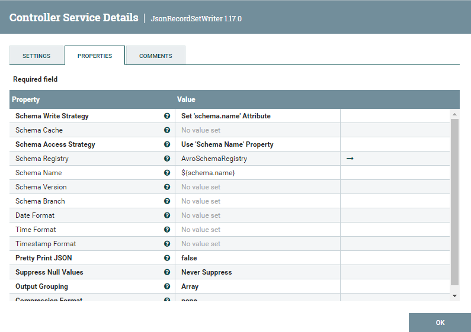

<br>

# **Challenge 1: Apache Nifi with local file and API**

## **First step**: Download the Apache Nifi from Docker Hub with a "docker pull" command

In the host CLI we execute the following command:

```bash
docker pull apache/nifi
```

Because a version is not specified in the command, the lastest will be downloaded in our local image repository. Once downloaded, we can execute the command:

```bash
docker images
```

and a detailed list of the available downloaded images will be displayed.


<br>

## **Second step**: Instantiate the apache/nifi image

In other words,


Abrimos en el puerto 8443 el Nifi, y adjudicamos una contraseña cualquiera a la sesion del usuario admin. Podemos comprobar con el comando docker ps que el contenedor está funcionando. Alternativamente, podemos verlo en Docker Desktop.


<br>

## **Tercer paso**: Copiamos el archivo que tenemos en el host en el contenedor en el cual estamos trabajando

Para poder hacer esta copia, primero de todo debemos saber en qué directorio estamos trabajando ejecutando un pwd en un prompt del contenedor. El directorio de trabajo en el contenedor es: **/opt/nifi/nifi-current**. Aquí, crearemos las carpetas input_files y output_files con el comando mkdir para diferenciar cuáles son los archivos input y output.
Una vez creados los directorios, copiaremos el archivo netflix.csv desde el host hasta el contenedor con el siguiente comando.


<br>

## **Cuarto paso**: Empezamos a crear el pipeline con la ingesta del csv

Escribimos el nombre del directorio y el file que queremos que coja.


Posteriormente le adjudicamos al flowfile un schema que se llamará _netflix_.


<br>

## **Quinto paso**: Filtramos los records deseados mediante una query SQL

Con el processor QueryRecord filtramos las peliculas aptas para mayores de 14, o dicho de otra manera las que no pueden ver menores de 14. Con la query:

> SELECT \* FROM FlowFile WHERE type LIKE '%Movie%' AND rating NOT IN ('TV-MA', 'NC-17','R')

poderemos filtrar las peliculas que no tengan los ratings:

- TV-MA: _"Mature Audience Only"_
- NC-17: _"No One under 17 and under Admitted"_
- R: _"Restricted"_


<br>

## **Sexto paso**: Transformamos el csv a json definiendo su esquema

Con el processor ConvertRecord, leemos el csv y lo escribimos como un json. El CSVReader inferirá el esquema, tendrá como delimitador una coma (véase en el mismo documento), e incluye los headers.


Por su parte, el JsonRecordSetWriter cogerá el schema que definamos en un registro de esquema Avro.



En la definición de esquema, debemos utilizar el mismo nombre de esquema que hemos utilizado en el UpdateAttribute del principio donde hemos definido su nombre. En este caso, lo hemos llamado _netflix_. Pasamos a definir todos sus campos como strings.


<br>

## **Séptimo paso**: Creamos el documento el el directorio output_files

Con el processor PutFile, configuramos el directorio donde queremos dejarlo.


<br>

## **Octavo paso**: Copiamos el archivo desde el contenedor hasta la carpeta host dónde estamos trabajando

De forma análoga a lo que hicimos para copiar el archivo netflix.csv desde el host hasta el contenedor, ahora copiamos el archivo resultante desde la carpeta output_files del contenedor hasta nuestro lugar de trabajo /RETO 3.


