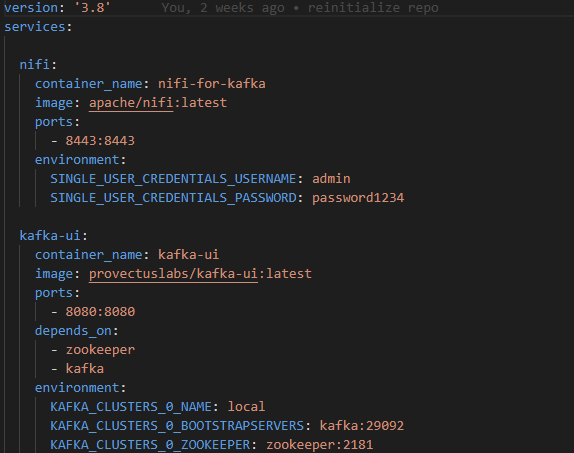
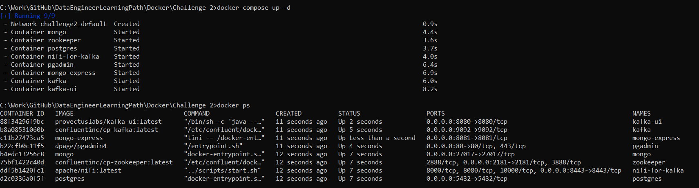
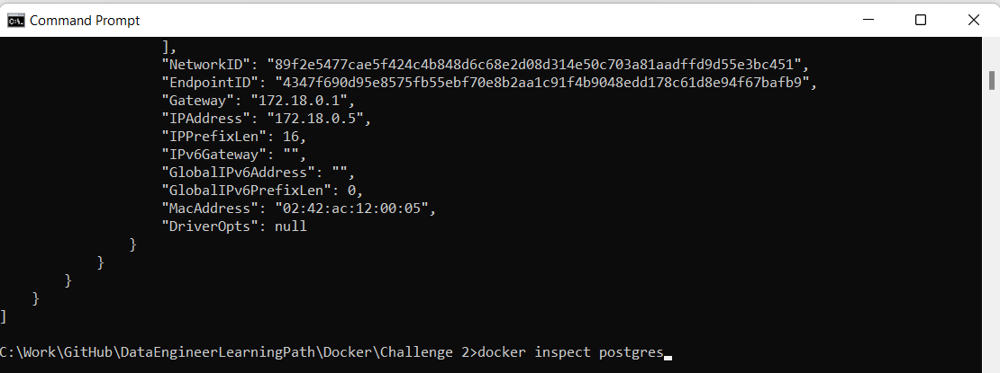
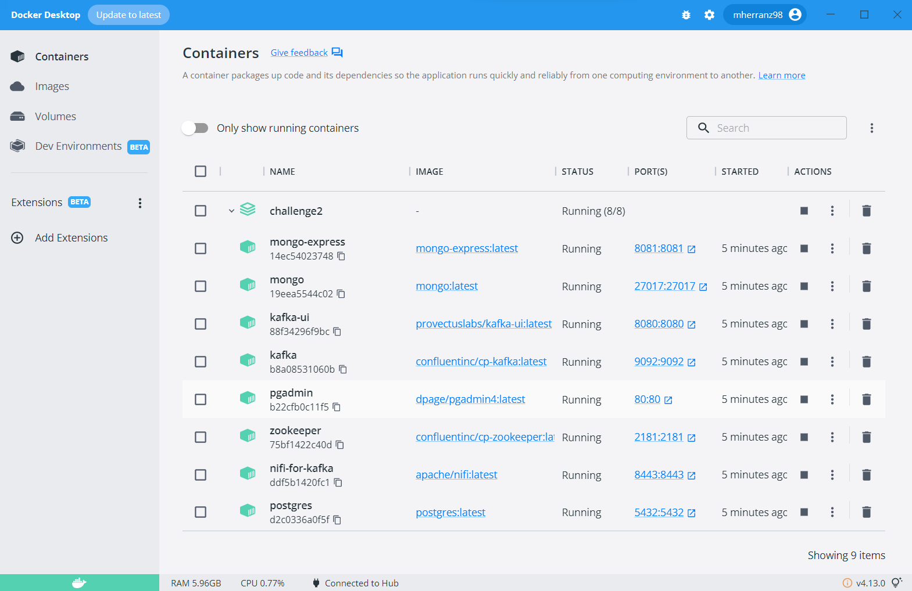
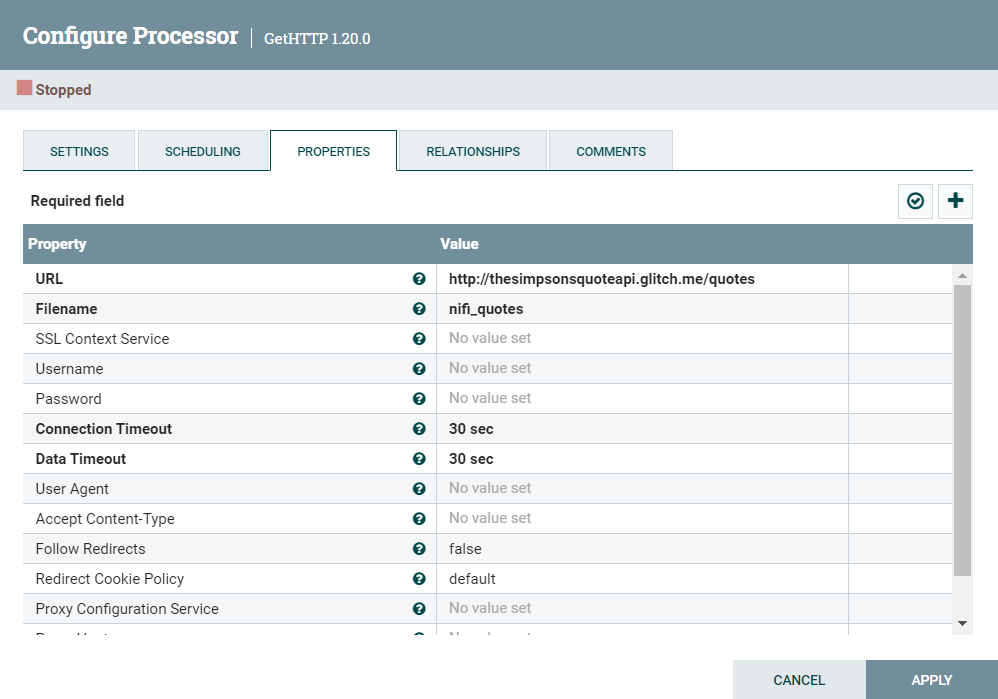
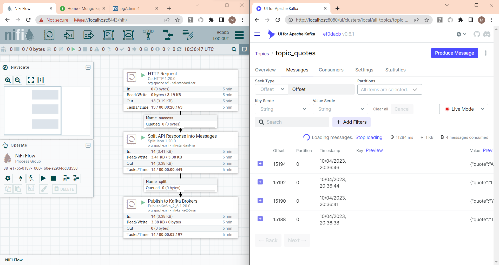
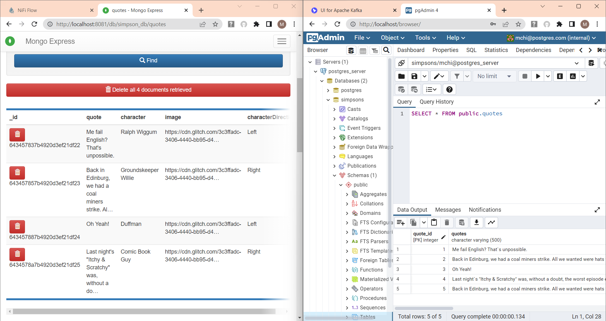

<br>
<br>

# **Challenge 2: Apache Kafka, Python and DBs 🐋🧑🏼‍💻**

---

The goal of this challenge is to familiarize yourself with Apache Kafka, an event streaming platform that enables us to handle real-time data feeds. We will go through the basics of its architecture and finally do some processing with a Python scripts. Resulting data will be pushed to databases, relational and non-relational.

In the second part of the [Challenge 1](../Challenge%201), we were able to discover the power of Nifi as an streaming tool. A similar pipeline will be used to stream data to a queue on Kakfa. This messages (or records) will be ingested, processed and written to DB using a Python script.

<br>

## **First step**: Download the required images and create compose file

In the host CLI we execute the following command:

```bash
docker pull <image_name>
```

Once downloaded, we will proceed creating a yaml file. Unlike with single running containers, a compose file allow us to define all the services we need to build our application, and the way they should interact with regard to ports or storage, amid others.
A yaml (or yml) file is a descriptive script that tells Docker the services we need, and this deploys all the infrastructure.



<br>

## **Second step**: Start the services in YAML file

We can start the compose by executing the following command:

```bash
docker-compose up -d
```

\*\*
With this command we are able to instantiate the image, that is creating a container. In the command we specify the name of the container "nifi", which must be unique, the ports mapped (port 8443 from container maps to port 8443 on host), and finally a single user authentication credentials that are specified as environment variables. No volumes are created so far (see Challenge 2)

Once executed, we can see in the Docker Desktop container page there is an instance of the Apache Nifi image running with some details are displayed. We can also display the running containers on the CLI by executing the command:

```bash
docker ps
```


We can also access the CLI of the container by clicking on the container of Docker Desktop and accessing the Terminal page in it. Another option is the execute the command below, which will make a bash CLI of the container pop up in the same host CLI. We can go back to the host terminal with an _exit_ command.

```bash
docker exec -it <container_name> /bin/bash
```



<br>

## **Third Step**: Copy the local file in host to nifi container

Because no volumes were mounted, we need to copy the required files stored in our host to the container so as to work with it. Afterwards, we will have to copy the resulting file to host.

To copy the file we must execute the following command in the host prompt:

```bash
docker cp data/netflix.json nifi:/opt/nifi/nifi-current/input_data
```

This command has been executed inside the Challenge 1 directory, so in order to access the json file we must write the relative path, and for the destination file we first need to specify the container name, which is the one we have given when instantiating the image in the run command, and the absolute path to the destination directory.

Note that by executing the command below on the _nifi/current_ directory, we can see that not all the read-write permissions of the input_data directory directory are granted.

```bash
dir -ls
```


<br>

## **Fourth Step**: Access the web-based interface of Nifi and build the pipeline

Enter the hyperlink [https://localhost:8443/nifi/](https://localhost:8443/nifi/), and after clicking on _Proceed Unsafe_, you need to introducte the credentials used when creating the container. Once logged in, we can start building the pipeline.

[Nifi](https://nifi.apache.org/docs/nifi-docs/html/nifi-in-depth.html) is an Apache project designed to integrate and automate the flow of data between systems. It is an open source low-code program that consists of the following components:

- **Web Server** is an HTTP-based component used to visualize the data flow and monitor the events in a user-friendly environment.
- **Flow Controller** is in charge of the Nifi behaviour, extensions and schedules
- **Flowfile** are data records that consist of the content and attributes of data.
- **Processors** are used to listen for incoming data; pull data from external sources; publish data to external sources; and route, transform, or extract information from FlowFiles.
- **Provenance** is a record of what tranformations have undegone the Flowfile.
- **Extensions** can be created to build your own processors with a rapid development and effective testing.
- **Repositories** allow us to undestand Flowfiles and how they have been used by the underlying system. There are three: Flowfile repository for metadata of current Flowfiles in the flow, Content repository for content of current and past Flowfiles, and Provenance repository for the history of Flowfiles.

Two different pipelines will be created; the first will read the data from a local json file, will filter some films depending on their film rating, and finally write it to a csv file. The second pipeline, on the contrary, will take the data from an API in streaming, it will apply some transformations and write the records in a csv file.

<br>

---

## **1. Batch pipeline with local JSON file**

The first processor we will need to use is the GetFile where we will write the absolute path of the JSON file in the container (because it is where the program is running, not on the host).

Afterwards, we will use the UpdateAttribute processor that takes the JSON and converts it into a CSV file. Once converted into a Flowfile, we can filter the records by simply applying a SQL-like query.

```SQL
SELECT * FROM FlowFile WHERE rating NOT IN ('TV-MA', 'NC-17', 'R')
```

This will exclude all films not allowed for people under 14 years old, which are the following ratings:

- TV-MA: _"Mature Audience Only"_
- NC-17: _"No One under 17 and under Admitted"_
- R: _"Restricted"_

To materialize the writing into a file, we will use a PutFile processor. In this, we will include the absolute path in the container.



Posteriormente le adjudicamos al flowfile un schema que se llamará _netflix_.


<br>

## **Quinto paso**: Filtramos los records deseados mediante una query SQL

Con el processor QueryRecord filtramos las peliculas aptas para mayores de 14, o dicho de otra manera las que no pueden ver menores de 14. Con la query:

> SELECT \* FROM FlowFile WHERE type LIKE '%Movie%' AND rating NOT IN ('TV-MA', 'NC-17','R')

poderemos filtrar las peliculas que no tengan los ratings:

- TV-MA: _"Mature Audience Only"_
- NC-17: _"No One under 17 and under Admitted"_
- R: _"Restricted"_



<br>

## **Sexto paso**: Transformamos el csv a json definiendo su esquema

Con el processor ConvertRecord, leemos el csv y lo escribimos como un json. El CSVReader inferirá el esquema, tendrá como delimitador una coma (véase en el mismo documento), e incluye los headers.


Por su parte, el JsonRecordSetWriter cogerá el schema que definamos en un registro de esquema Avro.


En la definición de esquema, debemos utilizar el mismo nombre de esquema que hemos utilizado en el UpdateAttribute del principio donde hemos definido su nombre. En este caso, lo hemos llamado _netflix_. Pasamos a definir todos sus campos como strings.



<br>

## **Séptimo paso**: Creamos el documento el el directorio output_files

Con el processor PutFile, configuramos el directorio donde queremos dejarlo.


<br>

## **Octavo paso**: Copiamos el archivo desde el contenedor hasta la carpeta host dónde estamos trabajando

De forma análoga a lo que hicimos para copiar el archivo netflix.csv desde el host hasta el contenedor, ahora copiamos el archivo resultante desde la carpeta output_files del contenedor hasta nuestro lugar de trabajo /RETO 3.


