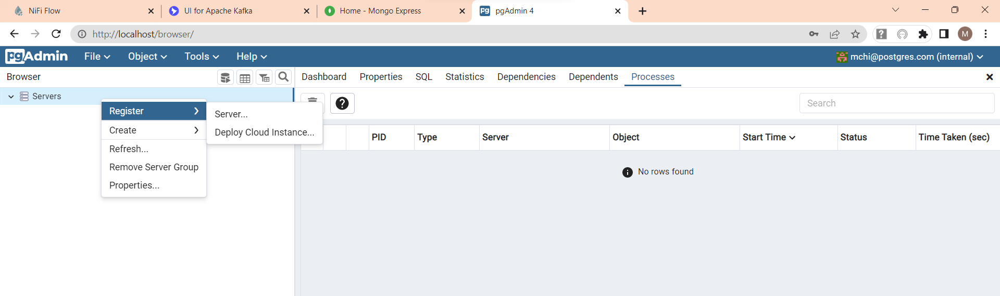
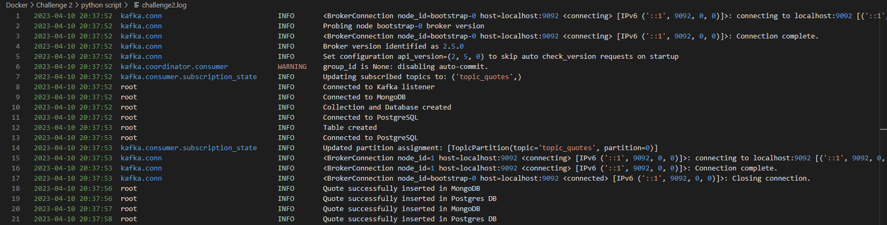

<br>
<br>

# **Challenge 2: Apache Kafka, Python and DBs 🐋🧑🏼‍💻**

---

The goal of this challenge is to familiarize yourself with Apache Kafka, an event streaming platform that enables us to handle real-time data feeds. We will go through the basics of its architecture and finally do some processing with a Python scripts. Resulting data will be pushed to databases, relational and non-relational.

In the [second part of the Challenge 1](../Challenge%201/README.md#readme-second), we were able to discover the power of Nifi as an streaming tool. A similar pipeline will be used to stream data to a queue on Kakfa. This messages (or records) will be ingested, processed and written to DB using a Python script.

Apache Kafka is a distributed streaming platform open-sourced by Apache Software Foundation that is used to handle large amounts of real-time data and provides a highly scalable and fault-tolerant architecture for streaming data.

At its core, Kafka consists of a few key components:

- **Brokers**: are servers that handle the storage and distribution of Kafka topics. Each broker stores one or more partitions of a topic, and all brokers work together to form a Kafka cluster. Brokers within a cluster communicate with each other to ensure data replication for fault tolerance.

- **Topics**: is a named stream of data that is divided into partitions. Somehow, they can be undestood as tables of event storage. Each partition of a topic can be replicated across multiple brokers for fault tolerance.

- **Producers**: are applications or processes that generate data to be sent to Kafka topics. Producers can send data to specific partitions or let Kafka decide which partition to write to based on a configurable partitioning strategy.

- **Consumers**: are applications or processes that read data from topics. They can subscribe to one or more topics and read data from specific partitions of those topics. Kafka supports both single-consumer and multi-consumer scenarios.

- **Consumer Groups**: is a group of consumers that work together to read data from Kafka topics. Each consumer in a consumer group reads data from a unique subset of partitions of a topic, and Kafka ensures that each partition is read by only one consumer in the group.

- **Connectors and APIs**: Kafka Connect is a framework for building and running connectors that move data between Kafka and other data systems such as databases, Hadoop, etc. It also provides various APIs for developers to work with, including a high-level streaming API and a lower-level producer and consumer API.

<p align = "center">
  
  <p align = "center">
    <i>Kafka Architecture</i>
  </p>  
</p>

One of the key features of Kafka is its ability to handle data in real-time with low latency, which makes it an ideal choice for real-time data processing (streaming analytics, monitoring, or alerting).

Apache Kafka uses ZooKeeper to manage and coordinate the cluster of Kafka brokers. ZooKeeper is a centralized service that provides distributed synchronization and coordination for distributed systems. At the end, it is responsible for:

- **Cluster coordination** as it keeps track of the status of each broker, the topics and partitions, and the configuration data for the cluster.

- It **elects the leader** because in a Kafka cluster, each partition of a topic is managed by a single broker, known as the leader. ZooKeeper helps to elect the leader for each partition in the event that the current leader fails or goes offline.

- Kafka uses ZooKeeper for **configuration management** as it stores and manages various configuration data, such as the location of topics, the number of replicas for each partition, and the offset of the last message read by a consumer.

- ZooKeeper can be used to **enforce quotas** on the number of requests that a Kafka broker can handle, to prevent from becoming overloaded.

Overall, ZooKeeper is a critical component of the Kafka ecosystem and plays a key role in managing the cluster and ensuring that it remains scalable, reliable, and fault-tolerant.

<p align = "center">
  
  <p align = "center">
    <i>Kafka Replication Strategy</i>
  </p>  
</p>

To know more about Kafka, read the article [`In-Depth Summary of Apache Kafka`](https://aozturk.medium.com/kafka-guide-in-depth-summary-5b3cb6dbc83c).

<br>

## **First step**: Create compose file and start its services

There is no need to download one by one the images that are going to be used in the challenge. Instead, by simply building up the compose, images not available in the local image repository will be downloaded (pull flag in _docker-compose up_ command is set to "always" by default).

We will proceed creating a yaml file that unlike with single running containers, it allow us to define all the services we need in order to build our application, and the way they should interact with regard to ports or storage, amid others.
A yaml (or yml) file is a declarative script that tells Docker the services we need to deploy and this does it by itself.

<p align = "center">
  
  <p align = "center">
    <i>Docker Compose YAML File</i>
  </p>  
</p>

<br>

We can start the services in the compose by executing the following command:

```bash
docker-compose up -d
```

<p align = "center">
  
  <p align = "center">
    <i>docker-compose up command</i>
  </p>  
</p>

<br>

This, will spin up all resources in the Docker Compose file with the configuration defined in it (network, volumes, image, version, etc.). The services we include in this challenge are:

- **Nifi** image which includes a UI that can be accessed through the port 8443
- **Kakfa** images that consist of 3 distinct services: a web-based UI, Zookeeper for distributed coordination of Kafka brokers (though not needed), and Kafka itself
- **Python** image to execute scripts
- **Postgres** which includes a UI named pgadmin and the database itself
- **MongoDB** which includes a UI named mongo-express and the database itself

<br>

## **Second step**: Design the streaming pipeline in Nifi

Once services are up and running, we can access Nifi in a similar way we did in Challenge 1. Next we will create a similar pipeline to the one we made in the [second part of the Challenge 1.](../Challenge%201/README.md#readme-second) The processors that we will use will be _GetHTTP_, _SplitJson_, and _Publish_Kafka_2_6_.

The first processor is resposible of performing the HTTP requests for the API and streaming the response to the SplitJson processor, which separates the different records stored in a single HTTP response and sends them into the publisher processor, which receives individual messages and publishes them into the Kafka topic.

<p align = "center">
  
  <p align = "center">
    <i>NiFi pipeline</i>
  </p>  
</p>

Because we want to publish the messages to Kafka, we will set the Kafka broker address to the name of the container that can be found executing the commands below, and the port number that was set to 9092 in the docker-compose file:

```bash
docker network ls
```

```bash
docker inspect <network_name>
```

This will display a list of the running containers in the compose chosen with its corresponding names. You will see that this name corresponds to the one set in the docker-compose file to the Kafka service.

Whilst running the pipeline, we can open the Kafka UI accessing the [http://localhost:8080/](http://localhost:8080/) and check that messages are properly being sent to the topic. The topic name is set in the publisher of the NiFi pipeline. We can set a Live mode so messages will be shown in the UI as they are published to the topic.

<p align = "center">
  
  <p align = "center">
    <i>Kafka UI in Live mode</i>
  </p>  
</p>

<br>

## **Third step**: Program the Python script

The Python scripts will be structured in the following manner:

```bash
PS C:\Work\GitHub\DataEngineerLearningPath\Docker\Challenge 2\python script> TREE /F
│   challenge2.log                      # log file for debugging and monitoring
│   main.py                             # main Python program
└───utils/                              # Folder with functions used in main.py script
    │   Kafka.py
    │   Mongo.py
    │   Postgres.py
    │   __init__.py
    │   __init__.pyc
    │
    └───__pycache__/                    # Compiled code of scripts (faster to start)
            Kafka.cpython-39.pyc
            Mongo.cpython-39.pyc
            Postgres.cpython-39.pyc
            __init__.cpython-39.pyc
```

- The **main.py** file contains the variables (credentials, names of DB or tables, etc.) that the functions stored in the utils directory will take. This script is the one that will be executed.

- The **utils directory** first contains a set of three Python classes, one for each technology that will be used during the challenge. First of all, there is a **Kafka class** that contains one single function that will be used to connect to the Kafka broker by means of the client library. In order to work with Kafka from a Python program, we must its client library for Python. It provides a convenient and powerful way for Python developers to produce and consume messages to and from Kafka clusters. Secondly, there is a Class for each of the databases. For **MongoDB class**, we defined three functions: one to connect to Mongo (container in Docker), one to create a database and a collection that will just be executed once the first message is inserted, and a final one to append the messages to the collection. For **Postgres class**, we created three functions: one that connects to the Postgres server (container in Docker), another that creates a table in the database specified in the docker-compose (simpsons), and a final one to insert each message to the table.

- Note that in all these classes, an **\_\_init\_\_** method is defined. This is the Python equivalent of the C++ constructor in an object-oriented approach. Every time an instance of an object is created from a class this function is called. Furthermore, we have a **\_\_init\_\_.py** file in the utils directory. Even though this is empty, it is used to mark directories on disk as Python package directories. If you have Python files you can import the code in them with:

```python
import directory.file
""" OR """
from directory import file
```

- If \_\_init\_\_.py file was removed, Python would no longer look for submodules inside that directory, so attempts to import the module will fail. Like in our case, the \_\_init\_\_.py file is usually empty, but can be used to export selected portions of the package under more convenient name, hold convenience functions, etc.
  When this is imported, the \_\_init\_\_ file is implicitly executed, and the objects it defines are bound to names in the package namespace. See the official [documentation](https://docs.python.org/3/reference/import.html#regular-packages) for more detail.

- Finally, there is a **\_\_pycache\_\_ directory** that contains bytecode-compiled versions of the program in directory utils. All it does is start the program a little faster as these files have been already been compiled by the Python interpreter. If the files changed, these will be recompiled as the import statement in main.py is executed. Similarly, in case they were deleted, they will be once more created when executing the main file.

### **Utils: Kafka, Postgres and MongoDB**

Let's first have a closer look at the classes in utils directory. Each of them has a set of functions define. Amidst these, there are functions for connecting to the services running in the Docker compose, reading from Kafka topic, or writing messages to both databases.

For the Kafka service, we have defined a single function that enables us to connect to Kafka bootstrap server and read from a specific topic:

```python
from kafka import KafkaConsumer
import logging


class Kafka:

    def __init__(self) -> None:
        self.connectKafka = "connectKafka"

    def connectKafka(topic: str, bootstrap_servers: str) -> KafkaConsumer:
        """Connect to Kafka Listener

        Args:
            - topic: Kakfa topic to read from
            - bootstrap_servers: host:port pair address of Kafka brokers

        Returns:
            - kafka.KafkaConsumer instance from which to consume messages
        """
        try:
            kafka_consumer = KafkaConsumer(
                topic, bootstrap_servers=bootstrap_servers)
            logging.info("Connected to Kafka listener")
            return kafka_consumer
        except Exception as e:
            logging.error("Unable to connect to Kafka listener")
            logging.exception(e)
            quit()
```

For the case of the databases, they both have functions to connect to the database server. Once this client authentication has been provided, actions like inserting, creating tables, etc. can be performed.

For the case of Postgres, functions are as follows:

```python
def connectPostgreSQL(host: str, port: str, database: str, username: str, password: str) -> dict:
    """Connect to PostgreSQL database

    Args:
        - host:
        - port:
        - database: name of the database to connecto to (defined in docker-compose file in our case)
        - username:
        - password:

    Returns:
        - dict { str : psycopg2.client, str : psycopg2.client.cursor } instance to connect to MongoDB
    """
    try:
        connection = Psycopg2Client(host=host, port=port, database=database,
                                    user=username, password=password)
        cursor = connection.cursor()
        logging.info("Connected to PostgreSQL")
        return {"connection": connection, "cursor": cursor}

    except Exception as e:
        logging.error("Unable to connect to PostgreSQL")
        logging.exception(e)

def createTablePostgreSQL(PostgresClient: Psycopg2Client, table_name: str, table_schema: str):
    """Create a table in PostgreSQL if not exists in the database to which we are connected

    Note: a schema must be provided as SQL databases are schema on-write

    Args:
        - PostgresClient: Psycopg2Client client instance to connect to Postgres database
        - table_name: name of table we want to create
        - table_schema: schema of the table we want to create
    """

    if PostgresClient is None:
        logging.error(
            "Unable to create table in Postgres due to missing client instance")
        quit()

    query = "CREATE TABLE IF NOT EXISTS public.{0} ({1})".format(
        table_name, table_schema)
    try:
        PostgresClient["cursor"].execute(query)
        PostgresClient["connection"].commit()
        logging.info("Table created")
    except Exception as e:
        logging.error("Unable to create table")
        logging.exception(e)

def writeKafkaMessageToPostgreSQL(message, PostgresClient):
    """Insert a single record into Postgres database

    Args:
        - message: message from Kafka consumer instance
        - PostgresClient: Psycopg2Client client instance to connect to Postgres database
    """
    if PostgresClient is None:
        logging.error(
            "Unable to write to Postgres due to missing client instance")

    decoded_msg = json.loads(message.value.decode("utf-8"))
    template = Template(
        """INSERT INTO public.quotes(quotes, charact, imag) VALUES ('$quote' , '$charact' , '$imag')""")
    query = template.substitute(
        quote=decoded_msg['quote'].replace("'", "`"), charact=decoded_msg['character'], imag=decoded_msg['image'])
    try:
        PostgresClient["cursor"].execute(query)
        PostgresClient["connection"].commit()
        logging.info("Quote successfully inserted in Postgres DB")
    except Exception as e:
        logging.error(
            "Unable to insert the message to PostgreSQL database")
        logging.exception(e)

```

Check [Mongo](python%20script/utils/Mongo.py) and [Postgres](python%20script/utils/Postgres.py) files for detailed explanation.

### **Main script**

This script is in charge of calling the functions from the utils classes. In this file, authentication variables are stated, although it is not best practice at all.

The script begins importing the classes defined in the utils directory scripts. Right after the imports, there is a snippet of code dedicated to setting the basic configuration and display options of the logging messages. In the configuration we have set the minimum level to information, which will allow us to display all messages from warning, error, message, etc. logging levels, the message format that includes datetime, level name and message, and the file to which these will be written. The _console_ variable defined afterwards enables to display in the command line the logging messages. Logging level for these is set at error, thereby solely error and critical logging messages are showed.

Note that in the functions of utils classes, the try-except error handling statement allows us to easily track where is the error coming from as a user error-level message is provided along with the message from the imported library.

After this logging option definition, the main function is defined. In this, authentication parameters, addresses, and other variables required for calling the functions, are stated. **_Improvements in this shall be done in near future._** First, one-time called functions are defined. Connections to different services (Kafka Listener, database servers) are stablished in conjunction to database, table and collection definitions. Once these have been created, we can start listening to the Kafka broker, and by means of a for loop insert the messages to the databases with their respective writing functions.

Finally, you might have noticed the if**name** == ""\_\_main\_\_"" statement. This condition is used to run parts of code when being executed as a script (case True), or when imported as a module (case False).

!!! Explain more

See this [page](https://realpython.com/if-name-main-python/) for further details.

```python
import logging
import json
from utils.Kafka import Kafka
from utils.Mongo import Mongo
from utils.Postgres import Postgres

# Set logging parameters for future monitoring, debugging or error-handling
logging.basicConfig(level=logging.INFO,
                    format='%(asctime)s %(name)-37s %(levelname)-10s %(message)s',
                    datefmt='%Y-%m-%d %H:%M:%S ',
                    filename="challenge2.log",
                    filemode='w')
# define a Handler which writes INFO messages or higher to the sys.stderr
console = logging.StreamHandler()
console.setLevel(logging.ERROR)
# add the handler to the root logger
logging.getLogger('').addHandler(console)

# ---------------------------------------------------------------------------------
# ------------------------------- MAIN PROGRAM ------------------------------------
# ---------------------------------------------------------------------------------


def main():

    # Connect to Kafka to consume latest messages and auto-commit offsets
    topic = 'topic_quotes'
    bootstrap_server = 'localhost:9092'
    kafka_consumer = Kafka.connectKafka(
        topic=topic, bootstrap_servers=bootstrap_server)

    # Connect to MongoDB with server configuration with authentication requirements
    host = "localhost"
    port = 27017  # Listener internal/external to Docker (9092/29092)
    username = "mchi"
    password = "mchi1234"
    database_name = "simpsons"

    # Connect to MongoDB
    mongoClient = Mongo.connectMongoDB(
        host=host, port=port, username=username, password=password)

    # Create MongoDB collection and database
    db_name = "simpson_db"
    collection_name = "quotes"
    collection = Mongo.createMongoCollection(
        mongoClient, db_name, collection_name)

    # Connect to Postgres with same authentication of Mongo and create table (schema on-write)
    port_postgres = "5432"
    table_name = "quotes"
    table_schema = """ quote_id SERIAL PRIMARY KEY,
	quotes VARCHAR(500),
	charact VARCHAR(500),
	imag VARCHAR(500)
        """
    # Create Postgres table in public part
    connection = Postgres.connectPostgreSQL(host=host, port=port_postgres, database=database_name,
                                            username=username, password=password)
    Postgres.createTablePostgreSQL(connection, table_name=table_name,
                                   table_schema=table_schema)

    connection = Postgres.connectPostgreSQL(host=host, port=port_postgres, database=database_name,
                                            username=username, password=password)

    # Insert messages in stream while connected to Kafka bootstrap server (kafka_consumer)
    for msg in kafka_consumer:
        """
        For every event in Kafka we receive two messages: content + metadata
        The content messages have a NULL msg.key, thus the condition below.
        Note that if we are not properly filtering these messages, we might get:
            ERROR: json.decoder.JSONDecodeError: Expecting value: line 1 column 1
        """
        if msg.key is None:
            Mongo.writeKafkaMessageToMongo(msg, collection)
            Postgres.writeKafkaMessageToPostgreSQL(msg, connection)
        else:
            pass

    connection["cursor"].close()


if __name__ == "__main__":
    main()

```

One thing we will need to consider when composing the Python script a is where it will be executed. So as to know the address of the listener, we must have in mind the Kafka Architecture briefly explained above. In case the program is executed in a container from Docker, the port must be the 9092. On the contrary, if trying to access the Kafka listener from outside Docker (localhost), port 29092 should be used.

<p align = "center">
  
  <p align = "center">
    <i>Kafka Architecture within Docker</i>
  </p>  
</p>

It is worth mentioning the libraries must be installed wherever this code is executed. In this case, where script is interpreted using the host hardware, libraries shall be previously installed running the following command in the interpreter that will be used:

```
py -m pip install psycopg2 && py -m pip install pymongo
```

<br>

## **Fourth step**: Run the Python program

We will run this program in two different ways:

- **Host machine execution**: program will be simply executed running a command in a local command prompt.
- **Containerized environment**: will need to design an additional container that will contain a Python image in it, and which, by means of volumes, will execute the script.

As we discussed short before, hinging on the execution host, the ports may vary.

Regardless of the execution mode, it is recommended to access the services UIs, logging in, and connecting to Docker services if required (like in Postgres case).

In the pgadmin web interface, we will first need to register the Postgres server to access it.

<p align = "center">
  
  <p align = "center">
    <i>Register Postgres server to access their contents from the UI</i>
  </p>  
</p>

<br>

<p align = "center">
  
  <p align = "center">
    <i>Connect to Postgres server using the IPAddress of the service and credentials</i>
  </p>  
</p>

<br>
 
At this point, we can start building and running the Nifi pipeline. We can also check that messages are being sent to the Kafka broker by accessing its UI.

<p align = "center">
  
  <p align = "center">
    <i>Run Nifi pipeline and see messages in Kafka topic with UI</i>
  </p>  
</p>

### **In the host machine**

For this case, the docker compose needed consists of Nifi, Kafka and both database images along with their respective UIs. Python directory is stored in the local machine, and it is from here where we will have to interact with the running Docker containers. It is thereby required to use the external address for connecting the host machine with the Docker host. The host:port pair for connecting the Python client (host machine) to Kafka broker (Docker host) is kafka:29092, because _kafka_ is the name of the Kafka service host (container name in Docker), and 29092 is the external port exposed by Kafka to access their brokers.

After all is set, we can run the main python script by executing in the local CLI the following command:

```bash
py main.py
```

This will run until an error occurs, or one stops it manually (Ctrl+C). To check that messages are being properly inserted in the databases, we can both access the log file or the database UIs.

<p align = "center">
  
  <p align = "center">
    <i>Inserted messages in Mongo DB and Postgres</i>
  </p>  
</p>

<br>

<p align = "center">
  
  <p align = "center">
    <i>Inserted messages in Mongo DB and Postgres</i>
  </p>  
</p>

<br>

<a name="build-image"></a>

### **Containerized Environment**

For this case, the docker compose needed consists of Nifi, Kafka, both database images along with their respective UIs, and finally a Python image that will be created using a Dockerfile. Python directory is stored in the local machine but by means of a volume it is mapped to the Python container. We will need to access the Python container image CLI to execute the python main script.
For that reason, we will need to use the internal address for connecting the Python container with the Kafka one as they both reside in the same Docker host. The host:port pair for connecting the Python client (host machine) to Kafka broker (Docker host) is kafka:9092, because _kafka_ is the name of the Kafka service host (container name in Docker), and 9092 is the internal port exposed by Kafka to access their brokers.

For building our own Python image, we will design it taking into consideration the layered architecture of Docker images. The first command in the Dockerfile is the FROM, which states the base image that will be used to start the build process. In our case, this will be a Python image.

After all is set, we can run the main python script by executing in the local CLI the following command:

```bash
py main.py
```
