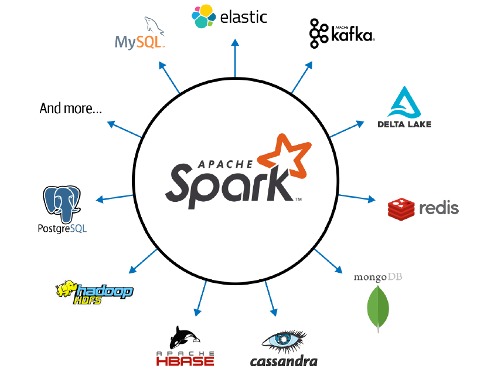

 
 

# **Challenge 4: PySpark, Apache Kafka, and DBs ✨🐍🧑🏼‍💻**

---

 

## **Introduction and theoretical basis**

After having reviewed the basics of Kafka, and relational and non-relational DBs, the goal of this challenge is to familiarize yourself with Apache Spark. Apache Spark is an open-source distributed computing system designed for big data processing and analytics. It provides a unified and high-level programming model that enables users to perform large-scale data processing tasks efficiently and quickly.

It is written in Scala and provides APIs in various programming languages such as Scala, Java, Python, and R, making it accessible to a wide range of developers. Spark's key feature is its ability to perform in-memory processing, which allows it to cache data in memory and perform operations much faster compared to traditional disk-based systems. It also provides fault tolerance and data parallelism, enabling it to handle large datasets across a cluster of computers.

Spark can be deployed on various cluster management systems like Apache Mesos, Hadoop YARN, or can run in standalone mode. It integrates well with other big data technologies like Hadoop, Hive, and HBase, allowing users to leverage existing data processing and storage infrastructures.

Overall, Apache Spark has gained popularity in the big data ecosystem due to its speed, scalability, and ease of use, making it de facto the big data unified processing engine and a popular choice for processing and analyzing large datasets in industries such as finance, e-commerce, healthcare, and telecommunications.

Due to its architecture, Spark key features are the following:

- **Speed**: taking advantage of efficient multithreading, parallel processing, as well as the improvements in price and performance of CPUs and memory, Spark has been able to optimize speed. Secondly, Spark builds its computations as DAGs which allows efficient computational graphs that can be decompodes into tasks executed in parallel across several workers of the cluster. Last but not least, it counts with a catalyzers and optimizers that enhance computational performance often retaining in memory intermediate results.

- **Modularity**: Spark can be programmed by means of different programming languages: Scala, Java, Python, SQL and R. It offers unified libraries with well-documented APIs to access the core components of the program: Spark SQL, Spark Structured Streaming, Spark MLlib, and GraphX. With Spark you can get a unified processing engine for disparate workloads.

- **Ease of Use**: Spark has been able to provide a simple and plain clear abstraction of logical data structures named RDD ("Resilient Distributed Dataset"), with higher-level structured data abstractions like DataFrames and DataSets. Spark provides a set of transformations and actions that enable data engineers to build complex pipelines without hesitating on low-level issues.

- **Extensibility**: unlike Hadoop, Spark decouples storage and parallel computation capabilities, and focuses on the last. You can read/write data from a myriad of data sources and process it all in memory. Spark developers mantains a list of third-party Spark packages, including their connectors, as part of a growing ecosystem.

  
  

    <i>Spark Connectors</i>
  
  

- **Spark Components as a Unified Stack**: Spark replaces the existing separate batch, graph, stream, and query processing engines like Storm, Impala, Dremel, Pregel, etc. with a unified stack of components that addresses diverse workloads under a single distributed fast engine.

- **Distributed Computing**:

  
  

    <i>Spark Features</i>
  
  

Apache Kafka uses ZooKeeper to manage and coordinate the cluster of Kafka brokers. ZooKeeper is a centralized service that provides distributed synchronization and coordination for distributed systems. At the end, it is responsible for:

- **Cluster coordination** as it keeps track of the status of each broker, the topics and partitions, and the configuration data for the cluster.

- It **elects the leader** because in a Kafka cluster, each partition of a topic is managed by a single broker, known as the leader. ZooKeeper helps to elect the leader for each partition in the event that the current leader fails or goes offline.

- Kafka uses ZooKeeper for **configuration management** as it stores and manages various configuration data, such as the location of topics, the number of replicas for each partition, and the offset of the last message read by a consumer.

- ZooKeeper can be used to **enforce quotas** on the number of requests that a Kafka broker can handle, to prevent from becoming overloaded.

Overall, ZooKeeper is a critical component of the Kafka ecosystem and plays a key role in managing the cluster and ensuring that it remains scalable, reliable, and fault-tolerant.

  
  

    <i>Kafka Replication Strategy</i>
  
  

 

---

 

## **First step**: Create compose file and start its services

## **Second step**: Design the streaming pipeline in Nifi

## **Third step**: Program the Python script

## **Fourth step**: Run the Python program

## **Running Python in Standalone Execution Mode**
