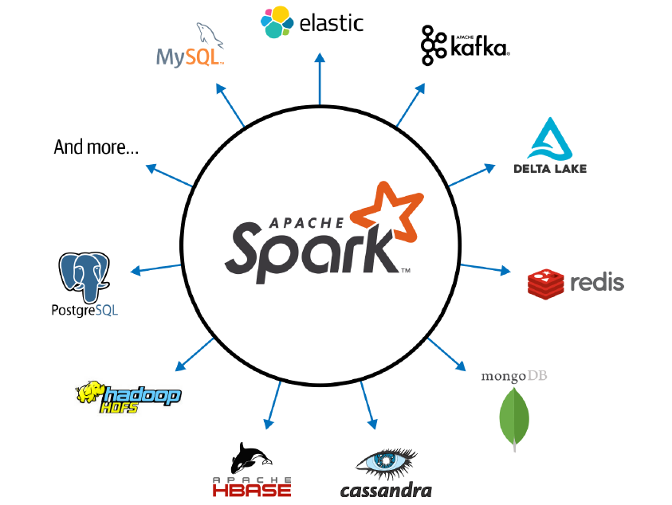
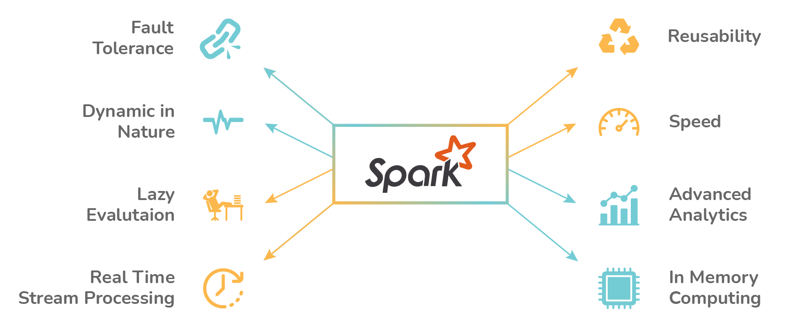

 
 

# **Challenge 5: Spark Scala with local files ✨🐍🧑🏼‍💻**

---

 

## **Introduction and theoretical basis**

After having reviewed the basics of Kafka, and relational and non-relational DBs, the goal of this challenge is to familiarize yourself with Apache Spark. Apache Spark is an open-source distributed computing system designed for big data processing and analytics. It provides a unified and high-level programming model that enables users to perform large-scale data processing tasks efficiently and quickly.

It is written in Scala and provides APIs in various programming languages such as Scala, Java, Python, and R, making it accessible to a wide range of developers. Spark's key feature is its ability to perform in-memory processing, which allows it to cache data in memory and perform operations much faster compared to traditional disk-based systems. It also provides fault tolerance and data parallelism.

Spark can be deployed on various cluster management systems like Apache Mesos, Hadoop YARN, or can run in standalone mode. It integrates well with other big data technologies like Hadoop, Hive, and HBase, allowing users to leverage existing data infrastructures.

Overall, Apache Spark has gained popularity in the big data ecosystem due to its speed, scalability, and ease of use, making it de facto the big data unified processing engine and a popular choice for processing and analyzing large datasets in industries such as finance, e-commerce, healthcare, and telecommunications.

Its key features are the following:

- **Speed**: taking advantage of efficient multithreading, parallel processing, as well as the improvements in price of CPUs and memory, Spark has been able to optimize speed. Secondly, Spark builds its computations as DAGs which allows efficient computational graphs that can be decompodes into tasks executed in parallel across several workers of the cluster. Last but not least, it counts with a catalyzers and optimizers that enhance computational performance often retaining in memory intermediate results.

- **Modularity**: Spark can be programmed by means of different programming languages: Scala, Java, Python, SQL and R. It offers unified libraries with well-documented APIs to access the core components of the program: Spark SQL, Spark Structured Streaming, Spark MLlib, and GraphX. With Spark you can get a unified processing engine for disparate workloads.

- **Ease of Use**: Spark has been able to provide a plain and clear abstraction of logical data structures named RDD ("Resilient Distributed Dataset"), with higher-level structured data abstractions like DataFrames and DataSets. Spark provides a set of transformations and actions that enable data engineers to build complex pipelines without hesitating on low-level issues.

- **Extensibility**: unlike Hadoop, Spark decouples storage and parallel computation capabilities, and focuses on the last. You can read/write data from a myriad of data sources and process it all in memory. Spark developers mantains a list of third-party Spark packages, including their connectors, as part of a growing ecosystem.

  
  

    <i>Spark Connectors</i>
  
  

- **Spark Components as a Unified Stack**: Spark replaces the existing separate batch, graph, stream, and query processing engines like Storm, Impala, Dremel, Pregel, etc. with a unified stack of components that addresses diverse workloads under a single distributed fast engine.

- **Distributed Computing**: Spark is a distributed data processing technology that uses its components to work collaboratively on a cluster of machines enhancing its computing performance. Let's explore how the different components of Spark work between them.

  
  

    <i>Spark Features</i>
  
  

 

## **Apache Spark's Distributed Execution**

Distributed computing refers to the use of multiple computers or systems working together to solve a computational problem. Instead of relying on a single powerful machine (high CPU/GPU), which used to be the way of working a few decades ago with relational databases, distributed computing leverages the combined processing power, storage capacity and a common network of interconnected nodes (servers), to achieve a common goal.

The main idea behind distributed computing is to break down a complex problem into smaller and more manageable tasks that can be processed concurrently by different nodes. Each node performs its portion of the computation or task independently, and the results are combined or coordinated to produce the final outcome.

Some **key aspects** of distributed computing are:

- **Workload Distribution** of tasks that are divided into smaller units, often referred to as subtasks or jobs, and distributed among the available nodes. This mechanism ensures that each node receives via the common network a proportional portion of the overall workload.

- **Coordination and Synchronization** of nodes to ensure proper execution and collaboration. There are multiple techniques that enable nodes to communicate, exchange data, and coordinate their activities to maintain consistency and avoid conflicts.

- **Fault Tolerance** enables to handle node failures or network disruptions gracefully. Techniques like redundancy, replication, and fault detection/recovery mechanisms help ensure system availability and reliability.

- **Data Sharing and Consistency** across multiple nodes. Techniques such as distributed file systems, distributed databases, or data replication ensure consistent and reliable data access and management.

Overall, distributed computing offers advantages such as improved performance, scalability, fault tolerance, and improved resource utilization. It finds applications in multiple domains, including scientific research, data analysis, cloud computing, distributed databases, and distributed artificial intelligence, among others.

 

Going back to Apache Spark architecture, the main components of a typical Spark cluster are the following:

1. **Driver Program** is the process running the main function of the application and creating the SparkContext. It contains the application's main function and defines the operations that executors (JVMs) need to perform on data. The driver program runs on a node in the cluster and is responsible for creating and managing the SparkContext.

2. **Spark Context** is the entry point to interact with the Spark cluster. It coordinates the execution of tasks and manages the cluster resources. The driver program communicates with the SparkContext to create RDDs, perform transformations and actions, and control the overall execution flow.

3. **Cluster Manager** is responsible for allocating and managing cluster's resources. Spark can work with different cluster managers, such as Apache Mesos, Hadoop YARN, or its standalone cluster manager. The cluster manager launches and monitors the Spark applications, assigns resources (CPU, memory), and manages fault tolerance. It corresponds to the master node of other technologies.

4. **Executors** run on the worker nodes and are responsible for executing tasks assigned by the driver program. Each executor has a certain amount of memory and CPU cores assigned by the cluster manager. Executors are responsible for communicating with the driver program as well as with the other executors for data exchange and task coordination, for storing intermediate data computations in memory, and for performing the required computations. In reality, they are JVMs that execute the application program.

5. **Worker nodes** are the individual servers that run the executors. Each worker node hosts one or more executors and provides the computing resources. These nodes receive instructions from the cluster manager and communicate with the driver program and other workers to perform data processing.

6. **Distributed Storage Systems** like Hadoop Distributed File System (HDFS), Amazon S3, or Apache Cassandra provide fault-tolerant and scalable storage for data processed by Spark. These systems rely on dividing data in several partitions that are sent to the multiple nodes of the cluster. Though it is not always possible, each Spark Executor (JVM) has the task assigned so that partition it needs to read is the closest in the network (observing its data locality and aiming to safe time and minimize bandwidth). Partitioning technique allows for efficient parallelism.

7. **Shuffle Manager** is responsible for coordinating the exchange of data between executors during operations that require data redistribution, such as groupByKey or reduceByKey. It manages the data shuffle process to efficiently transfer and aggregate data between different partitions on different nodes.

8. Last but not least, a common **network** is used to enable a fast and secure communication across nodes in order to coordinate, synchronize and distribute workload.

  
  

    <i>Spark Cluster Architecture</i>
  
  

 

## **Working with structured data in Spark**

RDD ("Resilient Distributed Dataset") is the core abstraction in Spark, representing a distributed collection of data that can be processed in parallel across the cluster. RDDs are fault-tolerant and immutable, allowing for data resilience and efficient distributed processing. They are created from data stored in distributed storage systems or by transforming existing RDDs using various operations.

With regard to Spark's unified stack components these include **Spark SQL** that is a module that works well with structured data, enables users to read and write to RDBMS or different file formats (AVRO, CSV, JSON, etc.), and even query with SQL-like statements. Secondly, **Spark MLlib** is a library containing the most common ML algorithms, but also common linear algebra operations and statistics. Regarding streaming jobs, Spark contains a module called **Spark Structured Streaming** that supports microbatching processing of structured (tabular) data while handling vital aspects for fault-tolerance or late-semantics. Last but not least, Spark contains a library for manipulating graph data structures named **GraphX**. It contains the basic algorithms for analysis, connections, and transversals.

---

 

## **First step**: Create compose file and start its services

## **Second step**: Design the streaming pipeline in Nifi

## **Third step**: Program the Python script

## **Fourth step**: Run the PySpark program

## **Running Python in Standalone Execution Mode**
